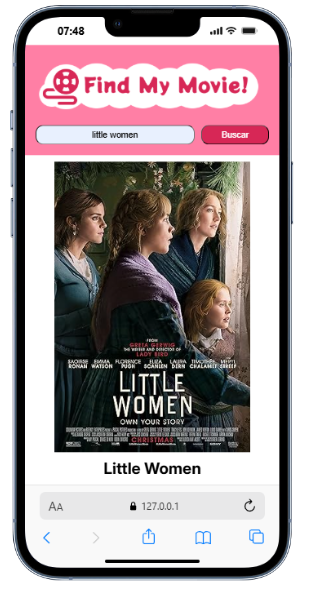

# Find my Movie!

## Desktop

## Tablet

## Mobile

Projeto de aplicação Front-End que consome a API pública **OMDb (Open Movie Database)**

---

## Funcionalidades

- Busca filmes pelo nome 
- Exibe informações detalhadas: título, ID no IMDb, data de lançamento, duração, diretor, sinopse, gênero, roteirista, elenco e país
- Mostra o pôster do filme
- Interface simples e responsiva

## Tecnologias Utilizadas

- **HTML**  
- **CSS**  
- **JavaScript**  
- **OMDb API pública**

## OMDb API

A aplicação consome a [OMDb API](https://www.omdbapi.com/).

## Autor

Maria Cecilia Pereira Jardim